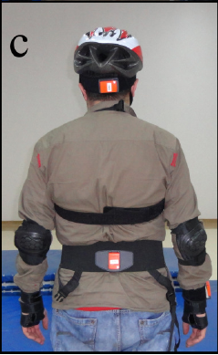

# Machine Learning Engineer Nanodegree

## Detecting Falls with Wearable Sensors

## Capstone Proposal
Frank Knoll  
July 1st, 2018

## Proposal

### Domain Background

One day you will be 65 years old. Then according to the World Health Organization[1] your chance of falling once a year is 28–35% with serious consequences such as heavy injuries. Imagine carrying a sensor or smartphone near your waist or thigh which recognizes your fall and immediately alerts a person to help you, that would be great. But imagine further the sensor would confuse one of your Activities of Daily Living (ADLs) such as sitting, standing or walking with a fall then the person to help you would have been alarmed without reason. Therefore such a sensor based fall detection system should not miss any falls and should also trigger no false alarms when performing ADLs.

- Özdemir, Ahmet Turan, and Billur Barshan. [“Detecting Falls with Wearable Sensors Using Machine Learning Techniques.”](http://www.mdpi.com/1424-8220/14/6/10691/pdf) Sensors (Basel, Switzerland) 14.6 (2014): 10691–10708. PMC. Web. 23 Apr. 2017.
- ["Investigation of Sensor Placement for Accurate Fall Detection"](https://www.researchgate.net/profile/Billur_Barshan/publication/318146579_Investigation_of_Sensor_Placement_for_Accurate_Fall_Detection/links/5999a8a745851564432dbdf7/Investigation-of-Sensor-Placement-for-Accurate-Fall-Detection.pdf?origin=publication_detail)
- [1] World Health Organization: Global report on falls prevention in older age. http://www.who.int/ageing/publications/Falls_prevention7March.pdf

### Problem Statement

The problem to be solved is to distinguish falls from activities of daily living (ADLs).
There are numerous types of falls and activities of daily living as can be seen in the following tables, but the task is just to binary classify actions in falls an non-falls.

#### Fall Actions:

#  | Label                  | Description
---|------------------------|---------------------------------------------------------------------------
1  | front-lying            | from vertical falling forward to the floor
2  | front-protecting-lying | from vertical falling forward to the floor with arm protection
3  | front-knees            | from vertical falling down on the knees
4  | front-knees-lying      | from vertical falling down on the knees and then lying on the floor
5  | front-right            | from vertical falling down on the floor, ending in right lateral position
6  | front-left             | from vertical falling down on the floor, ending in left lateral position
7  | front-quick-recovery   | from vertical falling on the floor and quick recovery
8  | front-slow-recovery    | from vertical falling on the floor and slow recovery
9  | back-sitting           | from vertical falling on the floor, ending sitting
10 | back-lying             | from vertical falling on the floor, ending lying
11 | back-right             | from vertical falling on the floor, ending lying in right lateral position
12 | back-left              | from vertical falling on the floor, ending lying in left lateral position
13 | right-sideway          | from vertical falling on the floor, ending lying
14 | right-recovery         | from vertical falling on the floor with subsequent recovery
15 | left-sideway           | from vertical falling on the floor, ending lying
16 | left-recovery          | from vertical falling on the floor with subsequent recovery
17 | syncope                | from standing falling on the floor following a vertical trajectory
18 | syncope-wall           | from standing falling down slowly slipping on a wall
19 | podium                 | from vertical standing on a podium going on the floor
20 | rolling-out-bed        | from lying, rolling out of bed and going on the floor

#### Non-Fall Actions (ADLs):

#  | Label             | Description
---|-------------------|---------------------------------------------------------------------------------
21 | lying-bed         | from vertical lying on the bed
22 | rising-bed        | from lying to sitting
23 | sit-bed           | from vertical to sitting with a certain acceleration onto a bed (soft surface)
24 | sit-chair         | from vertical to sitting with a certain acceleration onto a chair (hard surface)
25 | sit-sofa          | from vertical to sitting with a certain acceleration onto a sofa (soft surface)
26 | sit-air           | from vertical to sitting in the air exploiting the muscles of legs
27 | walking-fw        | walking forward
28 | jogging           | running
29 | walking-bw        | walking backward
30 | bending           | bending about 90 degrees
31 | bending-pick-up   | bending to pick up an object on the floor
32 | stumble           | stumbling with recovery
33 | limp              | walking with a limp
34 | squatting-down    | squatting, then standing up
35 | trip-over         | bending while walking and then continuing walking
36 | coughing-sneezing | coughing or sneezing

### Datasets and Inputs
_(approx. 2-3 paragraphs)_

In this section, the dataset(s) and/or input(s) being considered for the project should be thoroughly described, such as how they relate to the problem and why they should be used. Information such as how the dataset or input is (was) obtained, and the characteristics of the dataset or input, should be included with relevant references and citations as necessary It should be clear how the dataset(s) or input(s) will be used in the project and whether their use is appropriate given the context of the problem.

- describe dataset: "With  Erciyes University  Ethics  Committee  approval,  seven  males (24 ±  3 years old, 67.5  ±  13.5  kg, 172 ±  12  cm) and seven  females  (21.5  ±  2.5 years  old,  58.5 ±  11.5  kg, 169.5 ±  12.5  cm) healthy volunteers  participated in the study  with  informed  written consent. We  tightly  fitted  six  wireless  sensor  units  with  special  strap  sets  to  the subjects’ heads, chests,  waists, right wrists, right  thighs, and  right ankles. Each  unit comprises three tri-axial devices (accelerometer, gyroscope, and  magnetometer/compass)  with respective ranges  of  ±120  m/s2, ±1200o/s, and ±1.5  Gs,  and an  atmospheric  pressure meter  with  300–1100  hPa operating  range, which  we  did not use. We  recorded  raw motion  data along three perpendicular  axes  (x,  y,  z)  from  each  unit  with  a sampling frequency  of 25  Hz  [11].  A set of  trials consists  of  20  fall actions  (front-lying,  frontprotection-lying, front-knees, front-knees-lying, front-right,  front-left, front-quickrecovery,  front-slow-recovery, back-sitting,  back-lying, back-right, back-left,  rightsideway,  right-recovery, left-sideway, left-recovery,  syncope, syncope-wall,  podium, rolling-out-bed)  and  16  ADLs (lying-bed, rising-bed, sit-bed,  sit-chair, sit-sofa, sit-air, walking-forward, jogging,  walking-backward, bending,  bending-pick-up,  stumble, limp,  squatting-down, trip-over,  coughing-sneezing).  We  adopted these from [19] and each lasted  about 15  s  on  the average. The 14  volunteers  repeated each  test  for  five times. Thus,  we  acquired  a  considerably  diverse  dataset  comprising  1400  falls  (20  tasks ×  14 volunteers × 5  trials) and  1120  ADLs  (16  tasks × 14  volunteers × 5  trials),  resulting  in 2520  trials.  Many  of  the non-fall  actions  included  in  the  dataset are high-impact events that may be  easily  confused with  falls."
- detect  the peak  of the total acceleration  vector, keep  two  seconds of  the  sequence before and  after the peak  acceleration.
- Dataframe oder Tabelle einfügen mit waist- oder thigh-Beispieldaten.
- data/FallDataSet/101/Testler Export/901/Test_1/340535.txt:

| Acc_X | Acc_Y | Acc_Z | Gyr_X | Gyr_Y | Gyr_Z | Mag_X | Mag_Y | Mag_Z |
| ------------- |:-------------:| -----:|-----:| -----:| -----:| -----:| -----:| -----:|
| 9.715271 | 1.121521 |	0.947571 | 0.004578  | -0.004530 |	-0.004768| 	-0.818604 |	0.515137 |	0.012207 |
| 9.733534 | 1.131177 |	0.985241 | -0.014687 | -0.006580 |	0.000191 |	-0.818604 |	0.517334 |	0.009277 |
| 9.750366 | 1.103210 |	0.941467 | -0.003242 | 0.004053  |0.000763 	|-0.821045 |	0.517334 |	0.009521 |
| 9.745646 | 1.111937 | 0.999618 | 0.001383  | 0.005913  |-0.004005 	|-0.821045 |	0.515137 |	0.009766 |
| 9.725952 | 1.100159 |	1.019287 | -0.005913 | 0.006342  |-0.008965 	|-0.821045 |	0.517334 |	0.00683 |

[FallDataSet](https://drive.google.com/open?id=1gqS1fkTvtuAaKj_0cn9n04ng1qDAoZ2t)

### Solution Statement
_(approx. 1 paragraph)_

In this section, clearly describe a solution to the problem. The solution should be applicable to the project domain and appropriate for the dataset(s) or input(s) given. Additionally, describe the solution thoroughly such that it is clear that the solution is quantifiable (the solution can be expressed in mathematical or logical terms) , measurable (the solution can be measured by some metric and clearly observed), and replicable (the solution can be reproduced and occurs more than once).

- Feature extraction: "We parameterize each one  of  the nine  measured  events using the features proposed in  [11]: minimum, maximum  and  mean  values,  skewness,  kurtosis, the first 11  values of  the  autocorrelation  sequence  and the first five  frequencies with  maximum magnitude  of  the  DFT  along  with  the  five  corresponding  amplitudes, resulting  in  a feature vector  of  dimensionality  234  (26  features for each  one of  the nine  measured  signals) for each  test." Formeln aus Paper einfügen mit Erklärung der Variablen in den Formeln.
- $\operatorname{mean}(s) = \mu = \frac{1}{N} \sum_{n=1}^{N} s_n$
- $\operatorname{variance}(s) = \sigma^2 = \frac{1}{N} \sum_{n=1}^{N} (s_n-\mu)^2$
- $\operatorname{skewness}(s) = \frac{1}{N \sigma^3} \sum_{n=1}^{N} (s_n-\mu)^3$
- $\operatorname{kurtosis}(s) = \frac{1}{N \sigma^4} \sum_{n=1}^{N} (s_n-\mu)^4$
- $\operatorname{autocorrelation}(s) = \frac{1}{N - \Delta} \sum_{n=0}^{N - \Delta - 1} (s_n-\mu)(s_{n - \Delta} - \mu)$. where $\Delta = 0, 1, \dots, N-1$
- $\operatorname{DFT}_q(s) = \sum_{n=0}^{N-1} s_n e^{- \frac{j 2 \pi q n}{N}}$, where $q = 0, 1, \dots, N-1$
- Classification: Support Vector Machine
- 10-fold cross validation

### Benchmark Model
_(approximately 1-2 paragraphs)_

In this section, provide the details for a benchmark model or result that relates to the domain, problem statement, and intended solution. Ideally, the benchmark model or result contextualizes existing methods or known information in the domain and problem given, which could then be objectively compared to the solution. Describe how the benchmark model or result is measurable (can be measured by some metric and clearly observed) with thorough detail.

- "In  fall detection  studies, typically  simple thresholding  is used. A fall is detected  when the acceleration  suddenly  increases  due  to  the change  in  orientation  from  upright  to  lying position  [9]. In  [10],  the results  of  certain  threshold-based  methods  that consider fall impact, velocity and posture  have been assessed  and tested on elderly subjects,  achieving 94.6% sensitivity. Thresholding  methods sometimes tend  to  miss  “soft  falls,”  meaning falls that might  not  exceed the threshold.  Also,  certain  ADLs with high acceleration may exceed the threshold and  be misclassified as falls."
- random classifier
- J48 decision tree

### Evaluation Metrics
_(approx. 1-2 paragraphs)_

In this section, propose at least one evaluation metric that can be used to quantify the performance of both the benchmark model and the solution model. The evaluation metric(s) you propose should be appropriate given the context of the data, the problem statement, and the intended solution. Describe how the evaluation metric(s) are derived and provide an example of their mathematical representations (if applicable). Complex evaluation metrics should be clearly defined and quantifiable (can be expressed in mathematical or logical terms).

- sensitivity: $\mathit{Se} = \frac{\mathit{TP}}{\mathit{TP}+\mathit{FN}}$
- specificity: $\mathit{Sp} = \frac{\mathit{TN}}{\mathit{TN}+\mathit{FP}}$
- accuracy: $\mathit{Acc} = \frac{\mathit{TP}+\mathit{TN}}{\mathit{TP}+\mathit{FP}+\mathit{FN}+\mathit{TN}}$
- F-beta score?
- "The classification performance in terms of accuracy is used as the criterion to reveal the optimal sensor location."

### Project Design
_(approx. 1 page)_

In this final section, summarize a theoretical workflow for approaching a solution given the problem. Provide thorough discussion for what strategies you may consider employing, what analysis of the data might be required before being used, or which algorithms will be considered for your implementation. The workflow and discussion that you provide should align with the qualities of the previous sections. Additionally, you are encouraged to include small visualizations, pseudocode, or diagrams to aid in describing the project design, but it is not required. The discussion should clearly outline your intended workflow of the capstone project.

- analysis of the data might be required before being used:
- algorithms: J48 decision tree, k-nearest neighbors algorithm with value of k = 7 (IBk),  Random Forest (RF), Random Committee (RC) and SVM with RBF Kernel (SMO)

-----------

**Before submitting your proposal, ask yourself. . .**

- Does the proposal you have written follow a well-organized structure similar to that of the project template?
- Is each section (particularly **Solution Statement** and **Project Design**) written in a clear, concise and specific fashion? Are there any ambiguous terms or phrases that need clarification?
- Would the intended audience of your project be able to understand your proposal?
- Have you properly proofread your proposal to assure there are minimal grammatical and spelling mistakes?
- Are all the resources used for this project correctly cited and referenced?
