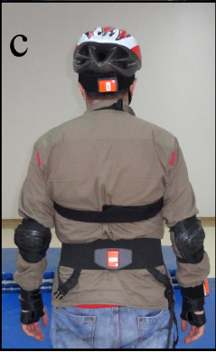
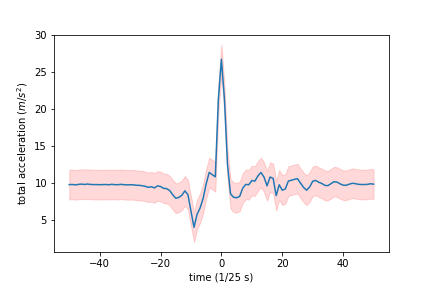

# Machine Learning Engineer Nanodegree

## Detecting Falls with Wearable Sensors

## Capstone Project
Frank Knoll  
July 19, 2018

## I. Definition
_(approx. 1-2 pages)_

### Project Overview
In this section, look to provide a high-level overview of the project in layman’s terms. Questions to ask yourself when writing this section:
- _Has an overview of the project been provided, such as the problem domain, project origin, and related datasets or input data?_
- _Has enough background information been given so that an uninformed reader would understand the problem domain and following problem statement?_

One day you will be 65 years old. Then according to the World Health Organization ([1]) your chance of falling once a year is 28–35% with serious consequences such as heavy injuries. Imagine carrying a sensor or smartphone near your waist or thigh which recognizes your fall and immediately alerts a person to help you, that would be great. But imagine further the sensor would confuse one of your Activities of Daily Living (ADLs) such as sitting, standing or walking with a fall, then the person to help you would have been alarmed without reason. Therefore such a sensor based fall detection system should not miss any falls and should also trigger no false alarms when performing ADLs.

### Problem Statement
In this section, you will want to clearly define the problem that you are trying to solve, including the strategy (outline of tasks) you will use to achieve the desired solution. You should also thoroughly discuss what the intended solution will be for this problem. Questions to ask yourself when writing this section:
- _Is the problem statement clearly defined? Will the reader understand what you are expecting to solve?_
- _Have you thoroughly discussed how you will attempt to solve the problem?_
- _Is an anticipated solution clearly defined? Will the reader understand what results you are looking for?_

TODO:
- define the **problem**:
- strategy (outline of tasks) to achieve the desired **solution**:

The problem to be solved is to distinguish falls from activities of daily living using a wireless sensor unit fitted to a person's waist or thigh.
There are numerous types of falls and activities of daily living as can be seen in the following tables, but the task is just to binary classify actions in falls and non-falls. A challenge in this classification task is not to confuse some of the non-fall actions, which are high-impact events, with falls.

#### Fall Actions:

TODO: soll der Leser wirklich die vollständigen folgenden beiden Tabellen präsentiert bekommen?

\#  | Label                  | Description
---|------------------------|---------------------------------------------------------------------------
1  | front-lying            | from vertical falling forward to the floor
2  | front-protecting-lying | from vertical falling forward to the floor with arm protection
3  | front-knees            | from vertical falling down on the knees
4  | front-knees-lying      | from vertical falling down on the knees and then lying on the floor
5  | front-right            | from vertical falling down on the floor, ending in right lateral position
6  | front-left             | from vertical falling down on the floor, ending in left lateral position
7  | front-quick-recovery   | from vertical falling on the floor and quick recovery
8  | front-slow-recovery    | from vertical falling on the floor and slow recovery
9  | back-sitting           | from vertical falling on the floor, ending sitting
10 | back-lying             | from vertical falling on the floor, ending lying
11 | back-right             | from vertical falling on the floor, ending lying in right lateral position
12 | back-left              | from vertical falling on the floor, ending lying in left lateral position
13 | right-sideway          | from vertical falling on the floor, ending lying
14 | right-recovery         | from vertical falling on the floor with subsequent recovery
15 | left-sideway           | from vertical falling on the floor, ending lying
16 | left-recovery          | from vertical falling on the floor with subsequent recovery
17 | syncope                | from standing falling on the floor following a vertical trajectory
18 | syncope-wall           | from standing falling down slowly slipping on a wall
19 | podium                 | from vertical standing on a podium going on the floor
20 | rolling-out-bed        | from lying, rolling out of bed and going on the floor

#### Non-Fall Actions (ADLs):

\#  | Label             | Description
---|-------------------|---------------------------------------------------------------------------------
21 | lying-bed         | from vertical lying on the bed
22 | rising-bed        | from lying to sitting
23 | sit-bed           | from vertical to sitting with a certain acceleration onto a bed (soft surface)
24 | sit-chair         | from vertical to sitting with a certain acceleration onto a chair (hard surface)
25 | sit-sofa          | from vertical to sitting with a certain acceleration onto a sofa (soft surface)
26 | sit-air           | from vertical to sitting in the air exploiting the muscles of legs
27 | walking-fw        | walking forward
28 | jogging           | running
29 | walking-bw        | walking backward
30 | bending           | bending about 90 degrees
31 | bending-pick-up   | bending to pick up an object on the floor
32 | stumble           | stumbling with recovery
33 | limp              | walking with a limp
34 | squatting-down    | squatting, then standing up
35 | trip-over         | bending while walking and then continuing walking
36 | coughing-sneezing | coughing or sneezing

The intendet solution is to train several machine learning classifiers like SVC, DecisionTreeClassifier, RandomForestClassifier, KNeighborsClassifier and a deep neural network on the FallDataSet in order to distinguish falls from activities of daily living.

### Metrics
In this section, you will need to clearly define the metrics or calculations you will use to measure performance of a model or result in your project. These calculations and metrics should be justified based on the characteristics of the problem and problem domain. Questions to ask yourself when writing this section:
- _Are the metrics you’ve chosen to measure the performance of your models clearly discussed and defined?_
- _Have you provided reasonable justification for the metrics chosen based on the problem and solution?_

TODO:
- define metrics and clearly discuss them:
  - vielleicht doch besser Accuracy und F-beta-score nehmen wie in finding_donors? Oder accuaracy, sensitivity und specificity und ROC curves wie im Paper?
- justification for the metrics:

In distinguishing falls from ADLs, the following conditions must be met:

- "False negatives, which indicate missed falls, must be avoided by all means, since user manipulation may not be possible if a fall results in physical and/or mental impairment." ([2])
- "False alarms (false positives) caused by misclassified ADLs, although a nuisance, can be canceled by the user." ([2])

So an evaluation metric should be chosen which punishes false negatives more than false positives. As can be seen from the formula of the $F_\beta$-score (https://en.wikipedia.org/wiki/F1_score) $F_\beta = \frac {(1 + \beta^2) \cdot \mathrm{true\ positive} }{(1 + \beta^2) \cdot \mathrm{true\ positive} + \beta^2 \cdot \mathrm{false\ negative} + \mathrm{false\ positive}}\,$ this can be achieved by setting $\beta>1$, e.g. $\beta = 2$. So the chosen evaluation metric is the $F_2$-score.

## II. Analysis
_(approx. 2-4 pages)_

### Data Exploration
In this section, you will be expected to analyze the data you are using for the problem. This data can either be in the form of a dataset (or datasets), input data (or input files), or even an environment. The type of data should be thoroughly described and, if possible, have basic statistics and information presented (such as discussion of input features or defining characteristics about the input or environment). Any abnormalities or interesting qualities about the data that may need to be addressed have been identified (such as features that need to be transformed or the possibility of outliers). Questions to ask yourself when writing this section:
- _If a dataset is present for this problem, have you thoroughly discussed certain features about the dataset? Has a data sample been provided to the reader?_
- _If a dataset is present for this problem, are statistics about the dataset calculated and reported? Have any relevant results from this calculation been discussed?_
- _If a dataset is **not** present for this problem, has discussion been made about the input space or input data for your problem?_
- _Are there any abnormalities or characteristics about the input space or dataset that need to be addressed? (categorical variables, missing values, outliers, etc.)_

TODO:
- (+) describe type of data: siehe Beschreibung unten
- calculate and report basic statistics, discuss relevant results of statistics calculation:
  - Statistik (Mean, Min, Max, Varianz, ...) für einen einzelnen Datensatz anzeigen?
  - (+) Diagramm anzeigen: x-Achse: Zeit, y-Achse: z.B. Acc_X oder total acceleration (siehe Paper)
  - (+) Verteilung der Falls und ADLs beschreiben: ungefähr fifty-fifty.
  - vielleicht PCA mit Diagramm anzeigen, und dass nur wenige der Features Min, Max, Mean, Kurtosis, ... notwendig sind um die Varianz in den Daten zu erklären.
- outliers, missing values:
  - (+) missing values, weil manchmal zu wenig Werte vorhanden sind, um um den Peak ein Fenster der Breite 100 zu legen.
  - (+) missing values auch, weil manchmal NaN in den CSV-Dateien steht => drop this rows
- (+) data sample: siehe Tabelle unten

Ten males and seven females participated in a study. A wireless sensor unit was fitted to the subject's waist among other body parts as can be seen in the figure. The sensor unit comprises three tri-axial devices: accelerometer, gyroscope, and  magnetometer/compass. Raw motion data was recorded along three perpendicular axes (x, y, z) from the unit with a sampling frequency of 25 Hz. A set of trials consists of 20 fall actions (see table 'Fall Actions' above) and 16 ADLs (see table 'Non-Fall Actions' above). Each trial lasted about 15s on average. The 17 volunteers repeated each test for five times. Then the peak of the total acceleration vector was detected, and two seconds of the sequence before and after the peak acceleration were kept. About ten trials of the dataset have recording times that are too short in order to set the time window of four seconds around the data. These trials were dropped. Within a single trial sometimes the sensor data for a specific point in time is missing (NaN). Records containing NaNs have been dropped. As an example, the first five records of the file `FallDataSet/101/Testler Export/901/Test_1/340535.txt` which contains the recorded data from the waist sensor attached to a male while he was falling from vertical forward to the floor, look like this:

| Acc_X ($m/s^2$) | Acc_Y ($m/s^2$) | Acc_Z ($m/s^2$) | Gyr_X (°/s) | Gyr_Y (°/s) | Gyr_Z (°/s) | Mag_X (Gauss) | Mag_Y (Gauss) | Mag_Z (Gauss) |
|-----------------|-----------------|-----------------|-------------|-------------|-------------|---------------|---------------|---------------|
| 9.715           | 1.121           | 0.947           | 0.004       | -0.004      | -0.004      | -0.818        | 0.515         | 0.012         |
| 9.733           | 1.131           | 0.985           | -0.014      | -0.006      | 0.000       | -0.818        | 0.517         | 0.009         |
| 9.750           | 1.103           | 0.941           | -0.003      | 0.004       | 0.000       | -0.821        | 0.517         | 0.009         |
| 9.745           | 1.111           | 0.999           | 0.001       | 0.005       | -0.004      | -0.821        | 0.515         | 0.009         |
| 9.725           | 1.100           | 1.019           | -0.005      | 0.006       | -0.008      | -0.821        | 0.517         | 0.000         |
| $\vdots$        | $\vdots$        | $\vdots$        | $\vdots$    | $\vdots$    | $\vdots$    | $\vdots$      | $\vdots$      | $\vdots$      |

The total acceleration $\sqrt{\text{Acc_X}^2 + \text{Acc_Y}^2 + \text{Acc_Z}^2}$ of this fall plotted over a four second time interval around it's peak at time 0 looks like this:

The total number of records consisting of falls and ADLs is 3296. Among them are 55.28% falls and 44.72% ADLs.

The FallDataSet kann be downloaded from

https://drive.google.com/open?id=1gqS1fkTvtuAaKj_0cn9n04ng1qDAoZ2t.

### Exploratory Visualization
In this section, you will need to provide some form of visualization that summarizes or extracts a relevant characteristic or feature about the data. The visualization should adequately support the data being used. Discuss why this visualization was chosen and how it is relevant. Questions to ask yourself when writing this section:
- _Have you visualized a relevant characteristic or feature about the dataset or input data?_
- _Is the visualization thoroughly analyzed and discussed?_
- _If a plot is provided, are the axes, title, and datum clearly defined?_

TODO:
- visualize relevant characteristic or feature:
  - vielleicht hier statt oben PCA anzeigen.
- why this visualization was chosen and how it is relevant:
  - PCA erklärt hier, dass wir nur wenige der Features den classifiern übergeben müssen.

### Algorithms and Techniques
In this section, you will need to discuss the algorithms and techniques you intend to use for solving the problem. You should justify the use of each one based on the characteristics of the problem and the problem domain. Questions to ask yourself when writing this section:
- _Are the algorithms you will use, including any default variables/parameters in the project clearly defined?_
- _Are the techniques to be used thoroughly discussed and justified?_
- _Is it made clear how the input data or datasets will be handled by the algorithms and techniques chosen?_

TODO:
- algorithms:
  - standard classifiers: SVC, DecisionTreeClassifier, RandomForestClassifier, KNeighborsClassifier arbeiten auf den extrahierten Features Min, Max, Mean, Var, Kurtotis, Autovarianz, ...
  - deep learning: CNN with LSTM arbeitet direkt auf den Rohdaten.
- techniques?

### Benchmark
In this section, you will need to provide a clearly defined benchmark result or threshold for comparing across performances obtained by your solution. The reasoning behind the benchmark (in the case where it is not an established result) should be discussed. Questions to ask yourself when writing this section:
- _Has some result or value been provided that acts as a benchmark for measuring performance?_
- _Is it clear how this result or value was obtained (whether by data or by hypothesis)?_

TODO:
- clearly defined benchmark: unten sind drei Benchmarks angegeben, besser nur einen einzigen verwenden. Es gibt noch weitere: Schwellwert classifier und den besten aus dem Paper (= SVC).

As a benchmark model the following classsifiers are used:

- random classifier
- classifier which classifies every action as a fall
- classifier which classifies every action as an activity of daily living

## III. Methodology
_(approx. 3-5 pages)_

### Data Preprocessing
In this section, all of your preprocessing steps will need to be clearly documented, if any were necessary. From the previous section, any of the abnormalities or characteristics that you identified about the dataset will be addressed and corrected here. Questions to ask yourself when writing this section:
- _If the algorithms chosen require preprocessing steps like feature selection or feature transformations, have they been properly documented?_
- _Based on the **Data Exploration** section, if there were abnormalities or characteristics that needed to be addressed, have they been properly corrected?_
- _If no preprocessing is needed, has it been made clear why?_

TODO:
- clearly document all preprocessing steps (feature selection): Min, Max, Mean, Kurtosis, Autovariance, ... (siehe unten)
- address and correct abnormalities

Following [2] the first task is to perform feature extraction. From the raw data Acc_X, Acc_Y, Acc_Z, Gyr_X, Gyr_Y, Gyr_Z, Mag_X, Mag_Y and Mag_Z of the FallDataSet the following features are extracted: minimum, maximum, mean, skewness, kurtosis, the first 11 values of the autocorrelation sequence and the first five frequencies with maximum magnitude of the discrete Fourier transform (DFT) along with the five corresponding amplitudes, resulting in a feature vector of dimensionality 234 (26 features for each one of the nine measured signals) for each test.

To be more specific, let $s = [s_1, s_2,\dots, s_N]^T$ be the raw data of a signal (e.g. the column Acc_X in the table above). Then the extracted features for this signal are defined as follows:

- $\operatorname{mean}(s) = \mu = \frac{1}{N} \sum_{n=1}^{N} s_n$
- $\operatorname{variance}(s) = \sigma^2 = \frac{1}{N} \sum_{n=1}^{N} (s_n-\mu)^2$
- $\operatorname{skewness}(s) = \frac{1}{N \sigma^3} \sum_{n=1}^{N} (s_n-\mu)^3$
- $\operatorname{kurtosis}(s) = \frac{1}{N \sigma^4} \sum_{n=1}^{N} (s_n-\mu)^4$
- $\operatorname{autocorrelation}(s) = \frac{1}{N - \Delta} \sum_{n=0}^{N - \Delta - 1} (s_n-\mu)(s_{n - \Delta} - \mu)$. where $\Delta = 0, 1, \dots, N-1$
- $\operatorname{DFT}_q(s) = \sum_{n=0}^{N-1} s_n e^{- \frac{j 2 \pi q n}{N}}$, where $q = 0, 1, \dots, N-1$

$\operatorname{DFT}_q(s)$ is the $q$th element of the 1-D $N$-point DFT.

Then the following classsifiers are applied to the feature data set using 10-fold cross validation: Decision Tree, K-Nearest Neighbors, Random Forest and Support Vector Machine. The classifier having the best $F_2$-score will be taken as the solution to the problem.

### Implementation
In this section, the process for which metrics, algorithms, and techniques that you implemented for the given data will need to be clearly documented. It should be abundantly clear how the implementation was carried out, and discussion should be made regarding any complications that occurred during this process. Questions to ask yourself when writing this section:
- _Is it made clear how the algorithms and techniques were implemented with the given datasets or input data?_
- _Were there any complications with the original metrics or techniques that required changing prior to acquiring a solution?_
- _Was there any part of the coding process (e.g., writing complicated functions) that should be documented?_

### Refinement
In this section, you will need to discuss the process of improvement you made upon the algorithms and techniques you used in your implementation. For example, adjusting parameters for certain models to acquire improved solutions would fall under the refinement category. Your initial and final solutions should be reported, as well as any significant intermediate results as necessary. Questions to ask yourself when writing this section:
- _Has an initial solution been found and clearly reported?_
- _Is the process of improvement clearly documented, such as what techniques were used?_
- _Are intermediate and final solutions clearly reported as the process is improved?_

TODO:
- discuss process of improvement (adjusting parameters): GridSearch, Auswahl der Features via PCA
- report initial and final solutions (vorher vs. nachher)

## IV. Results
_(approx. 2-3 pages)_

### Model Evaluation and Validation
In this section, the final model and any supporting qualities should be evaluated in detail. It should be clear how the final model was derived and why this model was chosen. In addition, some type of analysis should be used to validate the robustness of this model and its solution, such as manipulating the input data or environment to see how the model’s solution is affected (this is called sensitivity analysis). Questions to ask yourself when writing this section:
- _Is the final model reasonable and aligning with solution expectations? Are the final parameters of the model appropriate?_
- _Has the final model been tested with various inputs to evaluate whether the model generalizes well to unseen data?_
- _Is the model robust enough for the problem? Do small perturbations (changes) in training data or the input space greatly affect the results?_
- _Can results found from the model be trusted?_

### Justification
In this section, your model’s final solution and its results should be compared to the benchmark you established earlier in the project using some type of statistical analysis. You should also justify whether these results and the solution are significant enough to have solved the problem posed in the project. Questions to ask yourself when writing this section:
- _Are the final results found stronger than the benchmark result reported earlier?_
- _Have you thoroughly analyzed and discussed the final solution?_
- _Is the final solution significant enough to have solved the problem?_

## V. Conclusion
_(approx. 1-2 pages)_

### Free-Form Visualization
In this section, you will need to provide some form of visualization that emphasizes an important quality about the project. It is much more free-form, but should reasonably support a significant result or characteristic about the problem that you want to discuss. Questions to ask yourself when writing this section:
- _Have you visualized a relevant or important quality about the problem, dataset, input data, or results?_
- _Is the visualization thoroughly analyzed and discussed?_
- _If a plot is provided, are the axes, title, and datum clearly defined?_

### Reflection
In this section, you will summarize the entire end-to-end problem solution and discuss one or two particular aspects of the project you found interesting or difficult. You are expected to reflect on the project as a whole to show that you have a firm understanding of the entire process employed in your work. Questions to ask yourself when writing this section:
- _Have you thoroughly summarized the entire process you used for this project?_
- _Were there any interesting aspects of the project?_
- _Were there any difficult aspects of the project?_
- _Does the final model and solution fit your expectations for the problem, and should it be used in a general setting to solve these types of problems?_

### Improvement
In this section, you will need to provide discussion as to how one aspect of the implementation you designed could be improved. As an example, consider ways your implementation can be made more general, and what would need to be modified. You do not need to make this improvement, but the potential solutions resulting from these changes are considered and compared/contrasted to your current solution. Questions to ask yourself when writing this section:
- _Are there further improvements that could be made on the algorithms or techniques you used in this project?_
- _Were there algorithms or techniques you researched that you did not know how to implement, but would consider using if you knew how?_
- _If you used your final solution as the new benchmark, do you think an even better solution exists?_

------

- [1] World Health Organization: Global report on falls prevention in older age.
http://www.who.int/ageing/publications/Falls_prevention7March.pdf
- [2] Özdemir, Ahmet Turan, and Billur Barshan. “Detecting Falls with Wearable Sensors Using Machine Learning Techniques.” Sensors (Basel, Switzerland) 14.6 (2014): 10691–10708. PMC. Web. 23 Apr. 2017. http://www.mdpi.com/1424-8220/14/6/10691/pdf
- [3] Ntanasis P., Pippa E., Özdemir A.T., Barshan B., Megalooikonomou V., "Investigation of sensor placement for accurate fall detection", 6th EAI International Conference on Wireless Mobile Communication and Healthcare (MobiHealth), Milan, Italy, 14-16 Nov. 2016, pp.1-6. https://www.researchgate.net/profile/Billur_Barshan/publication/318146579_Investigation_of_Sensor_Placement_for_Accurate_Fall_Detection/links/5999a8a745851564432dbdf7/Investigation-of-Sensor-Placement-for-Accurate-Fall-Detection.pdf?origin=publication_detail

-----------

**Before submitting, ask yourself. . .**

- Does the project report you’ve written follow a well-organized structure similar to that of the project template?
- Is each section (particularly **Analysis** and **Methodology**) written in a clear, concise and specific fashion? Are there any ambiguous terms or phrases that need clarification?
- Would the intended audience of your project be able to understand your analysis, methods, and results?
- Have you properly proof-read your project report to assure there are minimal grammatical and spelling mistakes?
- Are all the resources used for this project correctly cited and referenced?
- Is the code that implements your solution easily readable and properly commented?
- Does the code execute without error and produce results similar to those reported?
