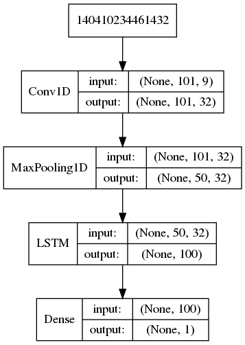
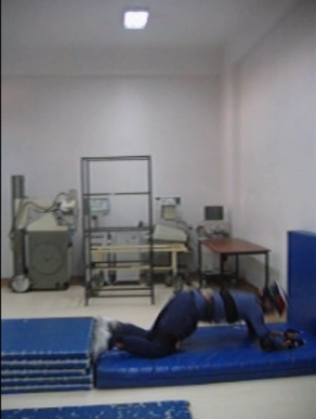

# Machine Learning Engineer Nanodegree

## Detecting Falls with Wearable Sensors

## Capstone Project
Frank Knoll  
July 19, 2018

## I. Definition

### Project Overview

One day you will be 65 years old. Then according to the World Health Organization ([1]) your chance of falling once a year is 28–35% with serious consequences such as heavy injuries. Imagine carrying a sensor or smartphone near your waist or thigh which recognizes your fall and immediately alerts a person to help you, that would be great. But imagine further the sensor would confuse one of your Activities of Daily Living (ADLs) such as sitting, standing or walking with a fall, then the person to help you would have been alarmed without reason. Therefore such a sensor based fall detection system should not miss any falls and should also trigger no false alarms when performing ADLs.

### Problem Statement

The problem to be solved is to distinguish falls from activities of daily living using a wireless sensor unit fitted to a person's waist or thigh.
There are numerous types of falls and activities of daily living as can be seen in the following lists, but the task is just to binary classify actions in falls and non-falls. A challenge in this classification task is not to confuse some of the non-fall actions, which are high-impact events, with falls.

Fall Actions:

- from vertical falling forward to the floor
- from vertical falling forward to the floor with arm protection
- from vertical falling down on the knees
- from vertical falling down on the knees and then lying on the floor
- from vertical falling down on the floor, ending in right lateral position
- from vertical falling down on the floor, ending in left lateral position
- from vertical falling on the floor and quick recovery
- from vertical falling on the floor and slow recovery
- from vertical falling on the floor, ending sitting
- from vertical falling on the floor, ending lying
- from vertical falling on the floor, ending lying in right lateral position
- from vertical falling on the floor, ending lying in left lateral position
- from vertical falling on the floor, ending lying
- from vertical falling on the floor with subsequent recovery
- from vertical falling on the floor, ending lying
- from vertical falling on the floor with subsequent recovery
- from standing falling on the floor following a vertical trajectory
- from standing falling down slowly slipping on a wall
- from vertical standing on a podium going on the floor
- from lying, rolling out of bed and going on the floor

Non-Fall Actions (ADLs):

- from vertical lying on the bed
- from lying to sitting
- from vertical to sitting with a certain acceleration onto a bed (soft surface)
- from vertical to sitting with a certain acceleration onto a chair (hard surface)
- from vertical to sitting with a certain acceleration onto a sofa (soft surface)
- from vertical to sitting in the air exploiting the muscles of legs
- walking forward
- running
- walking backward
- bending about 90 degrees
- bending to pick up an object on the floor
- stumbling with recovery
- walking with a limp
- squatting, then standing up
- bending while walking and then continuing walking
- coughing-sneezing | coughing or sneezing

The intendet solution is to train several machine learning classifiers like Decision Tree, K-Nearest Neighbors, Random Forest, Support Vector Machine and a deep neural network on a dataset containing falls and ADLs in order to learn to distinguish falls from activities of daily living.

### Metrics

TODO:
- define metrics and clearly discuss them:
  - verwende ausschließlich Accuracy, weil die Klassen fall und ADLs ausgewogen sind.
- justification for the metrics:

In distinguishing falls from ADLs, the following conditions must be met:

- "False negatives, which indicate missed falls, must be avoided by all means, since user manipulation may not be possible if a fall results in physical and/or mental impairment." ([2])
- "False alarms (false positives) caused by misclassified ADLs, although a nuisance, can be canceled by the user." ([2])

So an evaluation metric should be chosen which punishes false negatives more than false positives. As can be seen from the formula of the $F_\beta$-score (https://en.wikipedia.org/wiki/F1_score) $F_\beta = \frac {(1 + \beta^2) \cdot \mathrm{true\ positive} }{(1 + \beta^2) \cdot \mathrm{true\ positive} + \beta^2 \cdot \mathrm{false\ negative} + \mathrm{false\ positive}}\,$ this can be achieved by setting $\beta>1$, e.g. $\beta = 2$. So the chosen evaluation metric is the $F_2$-score.

## II. Analysis

### Data Exploration

Ten males and seven females participated in a study. A wireless sensor unit was fitted to the subject's waist and right thigh among other body parts as can be seen in the figure. The sensor unit comprises three tri-axial devices: accelerometer, gyroscope, and  magnetometer/compass. Raw motion data was recorded along three perpendicular axes (x, y, z) from the unit with a sampling frequency of 25 Hz yielding Acc_X, Acc_Y, Acc_Z ($m/s^2$), Gyr_X, Gyr_Y, Gyr_Z (°/s) and Mag_X, Mag_Y, Mag_Z (Gauss). A set of trials consists of 20 fall actions (see list 'Fall Actions' above) and 16 ADLs (see list 'Non-Fall Actions' above). Each trial lasted about 15s on average. The 17 volunteers repeated each test five times. Then the peak of the total acceleration vector $\sqrt{\text{Acc\_X}^2 + \text{Acc\_Y}^2 + \text{Acc\_Z}^2}$ was detected, and two seconds of the sequence before and after the peak acceleration were kept.

About ten trials of the dataset have recording times that are too short in order to set the time window of four seconds around the peak acceleration. These trials have been dropped. Within a single trial sometimes the sensor data for a specific point in time is missing (NaN). Records containing NaNs have been dropped.

As an example, the first five records of the file `FallDataSet/101/Testler Export/901/Test_1/340535.txt` which contains the recorded data from the waist sensor attached to a male while he was falling from vertical forward to the floor, look like this:

| Acc_X ($m/s^2$) | Acc_Y ($m/s^2$) | Acc_Z ($m/s^2$) | Gyr_X (°/s) | Gyr_Y (°/s) | Gyr_Z (°/s) | Mag_X (Gauss) | Mag_Y (Gauss) | Mag_Z (Gauss) |
|-----------------|-----------------|-----------------|-------------|-------------|-------------|---------------|---------------|---------------|
| 9.715           | 1.121           | 0.947           | 0.004       | -0.004      | -0.004      | -0.818        | 0.515         | 0.012         |
| 9.733           | 1.131           | 0.985           | -0.014      | -0.006      | 0.000       | -0.818        | 0.517         | 0.009         |
| 9.750           | 1.103           | 0.941           | -0.003      | 0.004       | 0.000       | -0.821        | 0.517         | 0.009         |
| 9.745           | 1.111           | 0.999           | 0.001       | 0.005       | -0.004      | -0.821        | 0.515         | 0.009         |
| 9.725           | 1.100           | 1.019           | -0.005      | 0.006       | -0.008      | -0.821        | 0.517         | 0.000         |
| $\vdots$        | $\vdots$        | $\vdots$        | $\vdots$    | $\vdots$    | $\vdots$    | $\vdots$      | $\vdots$      | $\vdots$      |

The dataset consists of 1822 (55.28%) falls and 1474 (44.72%) ADLs.

The FallDataSet kann be downloaded from

https://drive.google.com/open?id=1gqS1fkTvtuAaKj_0cn9n04ng1qDAoZ2t.

### Exploratory Visualization

TODO:
- visualize relevant characteristic or feature:
  - vielleicht hier statt oben PCA anzeigen.
  - https://seaborn.pydata.org/generated/seaborn.pairplot.html oder pandas scatter_matrix, um die Korrelation der Features Min, Max, Mean, ... anzuzeigen (https://pandas.pydata.org/pandas-docs/stable/visualization.html).
- why this visualization was chosen and how it is relevant:
  - PCA erklärt hier, dass wir nur wenige der Features den classifiern übergeben müssen.

The mean of the total acceleration $\sqrt{\text{Acc\_X}^2 + \text{Acc\_Y}^2 + \text{Acc\_Z}^2}$ of all 1822 falls plotted over a four second time interval around their peak at time 0 looks like this:

TODO:
  - Verwende seaborn tsplot: https://seaborn.pydata.org/generated/seaborn.tsplot.html]
  - nur den Mean über alle Falls eines bestimmten Typs (8xx) anzeigen. Eventuell auch noch ein Diagramm einfügen, das die ersten x Falls anzeigt.

The mean of the total acceleration of all 1474 falls plotted over a four second time interval around their peak at time 0 looks like this:
  [TODO: Verwende seaborn tsplot: https://seaborn.pydata.org/generated/seaborn.tsplot.html, und auch hier nur die ADLs eines bestimmten Typs (9xx) anzeigen.]

### Algorithms and Techniques

The following standard machine learning classifiers are applied to the dataset (obtained from the FallDataSet by feature extraction, see section 'Data Preprocessing'): Decision Tree, K-Nearest Neighbors, Random Forest and Support Vector Machine. These classifiers are described as promising candidates in [2].

Then by using the raw sensor data in contrast to the feature extracted data, a LSTM recurrent neural network is applied to the raw FallDataSet following [4].

The classifiers having the highest accuracies will be taken as solutions to the problem.

### Benchmark

As can be seen in the accompanying jupyter notebook `DetectingFalls.ipynb`, a principal component analysis shows, that 98% variance in the data obtained by feature extraction (see section 'Data Preprocessing') is explained by the first principal component. Furthermore the first principal component points mainly (0.9974) in the direction of the feature `Acc_Z_var`, which is the variance of the acceleration in the z direction. So a classifier fitted to a training dataset consisting solely of the feature `Acc_Z_var` should have enough information to distinguish falls from ADLs. A Gaussian Naive Bayes (GaussianNB) classifier fitted to this training set yields an accuracy of 67% on the testing set, which is better than 56% accuracy for a classifier which classifies every action as a fall and better than 44% accuracy for a classifier which classifies every action as an activity of daily living. So the GaussianNB classifier will be the benchmark model.

## III. Methodology

### Data Preprocessing

Following [2] the first task is to perform feature extraction. From the raw data Acc_X, Acc_Y, Acc_Z, Gyr_X, Gyr_Y, Gyr_Z, Mag_X, Mag_Y and Mag_Z of the FallDataSet the following features are extracted: minimum, maximum, mean, variance, skewness, kurtosis and the first 11 values of the autocovariance sequence, resulting in a feature vector of dimensionality 153 (17 features for each one of the nine measured signals) for each test.

To be more specific, let $s = [s_1, s_2,\dots, s_N]^T$ be the raw data of a signal (e.g. the column Acc_X of the table in the section 'Data Exploration'). Then the extracted features for this signal are defined as follows:

- $\operatorname{mean}(s) = \mu = \frac{1}{N} \sum_{n=1}^{N} s_n$
- $\operatorname{variance}(s) = \sigma^2 = \frac{1}{N} \sum_{n=1}^{N} (s_n-\mu)^2$
- $\operatorname{skewness}(s) = \frac{1}{N \sigma^3} \sum_{n=1}^{N} (s_n-\mu)^3$
- $\operatorname{kurtosis}(s) = \frac{1}{N \sigma^4} \sum_{n=1}^{N} (s_n-\mu)^4$
- $\operatorname{autocovariance}(s) = \frac{1}{N} \sum_{n=1}^{N - \Delta} (s_n - \mu)(s_{n + \Delta} - \mu)$, where $\Delta = 0, 1, \dots, N-1$

### Implementation

#### Standard Machine Learning Classifiers
The implementation was carried out in _python_ using the machine learning library _sklearn_.

Each of the classifiers Decision Tree, K-Nearest Neighbors, Random Forest and Support Vector Machine was fitted to the training dataset (obtained from the FallDataSet by feature extraction, see section 'Data Preprocessing') and the resulting accuracy scores on the test dataset were reported:

The dashed line in the figure above is the score of the benchmark model.

The best performing classifier is the K-Nearest Neighbors classifier yielding an accuracy score of 99.7%.

#### LSTM Recurrent Neural Network

The implementation was carried out in _python_ using the neural networks API _keras_ and the _TensorFlow_ backend.

The network architecture is taken from [4] an is shown in the figure below.

The network is directly applied to the raw sensor training data yielding an accuracy score above 99% on the test data.

### Refinement

TODO:
- improve LSTM model

In order to improve the K-Nearest Neighbors classifier (which yielded an accuracy of 99.7%) I used grid search on the classifiers hyper parameters 'n_neighbors' using values 5, 6 and 7, 'weights' using values 'uniform' and 'distance' and the 'p' parameter using values 1 and 2. The resulting classifier yields an improved accuracy of 99.85%.

In a attempt to reduce the number of features (153) I performed a Principal Component Analysis on the training feature dataset to obtain 54 dimensions which explain most of the variance in the training data. Then I fitted the optimized K-Nearest Neighbors classifier from the last step to this reduced dataset having only 54 dimensions. The accuracy score on the testing set was 99.85% which is the same accuracy the K-Nearest Neighbors classifier yielded on the full feature dataset having 153 features. So a dimensionality reduction of the feature space from 153 to 85 dimensions without any loss of accuracy is a succesful simplification.

## IV. Results

### Model Evaluation and Validation

Both evaluated models -- K-Nearest Neighbors classifier and LSTM Recurrent Neural Network -- generalize nearly equally well on unseen data with an accuracy above 99% as summarized in the table below:

Model                                                                            | Accuracy on test data
---------------------------------------------------------------------------------|----------------------
K-Nearest Neighbors classifier operating on 54 (out of 153) principal components | 99.85%
LSTM Recurrent Neural Network operating on raw sensor data                       | 99.70%

One advantage of the LSTM Recurrent Neural Network is that it directly operates on _raw_ sensor data extracting features on it's own in it's convolutional layer whereas the K-Nearest Neighbors classifier has to be provided with features extracted from the raw sensor data in a preprocessing step.

It looks as if neither model is much better than the other, so both models -- K-Nearest Neighbors classifier and LSTM Recurrent Neural Network -- can be used as final models.

### Justification

Both final models -- K-Nearest Neighbors classifier and LSTM Recurrent Neural Network -- have much higher accuracy than the GaussianNB benchark model as shown in the table below:

Model                                                                             | Type        | Accuracy on test data
----------------------------------------------------------------------------------|-------------|----------------------
K-Nearest Neighbors classifier operating on 54 (out of 153) principal components  | final model | 99.85%
LSTM Recurrent Neural Network operating on raw sensor data                        | final model | 99.70%
Support Vector Machine applied to thigh sensor data, reported in [3]             | benchmark   | 99.48%
benchmark model (GaussianNB) operating on single (out of 153) feature `Acc_Z_var` | benchmark   | 67%

Another model reported in [3] is a Support Vector Machine applied to data obtained from a sensor attached to a test person's right thigh. It has an accuracy almost as high as the accuracies of the final models.

Having high accuracies of above 99% the final models are significant enough to have adequately solved the problem.

## V. Conclusion

### Free-Form Visualization

The table below shows a fall (from a podium falling on the floor) and an activity of daily living (lying on the bed) which are both high-impact events having high total acceleration peaks in their time series diagrams:

**Type:**               | Fall                                                          | ADL
--------------------|---------------------------------------------------------------|--------------------------------------------------------------
**Action:**         | from vertical standing on a podium going on the floor         | from vertical lying on the bed
**Video Snapshot:** |  | 
**Time Series:**    |            | 

TODO: programmatisch bestätigen, dass diese beiden activities in obiger Tabelle vom final model korrekt unterschieden werden können.

As both time series diagrams have differing total acceleration peaks, it seems that a threshold algorithm could distinguish this fall from the ADL. Maybe such a threshold algorithm also could have been a good candidate for a benchmark model.

### Reflection

TODO:
- discuss one or two particular aspects of the project you found interesting or difficult:

The problem to solve is to distinguish falls from activities of daily living using sensor data. Two machine learning classifiers -- K-Nearest Neighbors classifier and LSTM Recurrent Neural Network -- were tested as potential solutions to this problem. In order to make them work, the following steps have been performed:

Steps                                                       | Apply step on K-Nearest Neighbors classifier?                                 | Apply step on LSTM Recurrent Neural Network?
------------------------------------------------------------|-------------------------------------------------------------------------------|---------------------------------------------
get FallDataSet with time series data obtained from sensors | yes                                                                           | yes
extract features from FallDataSet                           | yes, extract features Min, Max, Mean, Variance, Kurtosis, Autocovariance, ... | no, operate on raw data instead
train and improve classifier                                | yes, improve by applying grid search                                          | yes

The main difference between these two classifiers is that the LSTM Recurrent Neural Network directly operates on raw sensor data whereas the K-Nearest Neighbors classifier has to be provided with features extracted from the raw sensor data in a preprocessing step.

### Improvement

The FallDataSet was recorded under laboratory conditions performing voluntary falls. One possible improvement in detecting falls with wearable sensors is to obtain more realistic data by incorporating _involuntary_ falls, which are not that easy to get.

The final models developed here have higher accuracies than the Support Vector Machine reported in [3] despite they operate on the same kind of data. The reason for this could be that in [3] 14 persons (seven males and seven females) participated in the study but meanwhile the dataset has grown to 17 persons (ten males and seven females). Maybe even higher accuracies can be obtained by further incorporating more falls and ADLs of more persons into the dataset.

### References

- [1] World Health Organization: Global report on falls prevention in older age.
http://www.who.int/ageing/publications/Falls_prevention7March.pdf
- [2] Özdemir, Ahmet Turan, and Billur Barshan. “Detecting Falls with Wearable Sensors Using Machine Learning Techniques.” Sensors (Basel, Switzerland) 14.6 (2014): 10691–10708. PMC. Web. 23 Apr. 2017. http://www.mdpi.com/1424-8220/14/6/10691/pdf
- [3] Ntanasis P., Pippa E., Özdemir A.T., Barshan B., Megalooikonomou V., "Investigation of sensor placement for accurate fall detection", 6th EAI International Conference on Wireless Mobile Communication and Healthcare (MobiHealth), Milan, Italy, 14-16 Nov. 2016, pp.1-6. https://www.researchgate.net/profile/Billur_Barshan/publication/318146579_Investigation_of_Sensor_Placement_for_Accurate_Fall_Detection/links/5999a8a745851564432dbdf7/Investigation-of-Sensor-Placement-for-Accurate-Fall-Detection.pdf?origin=publication_detail
- [4]
Sequence Classification with LSTM Recurrent Neural Networks in Python with Keras. https://machinelearningmastery.com/sequence-classification-lstm-recurrent-neural-networks-python-keras/
